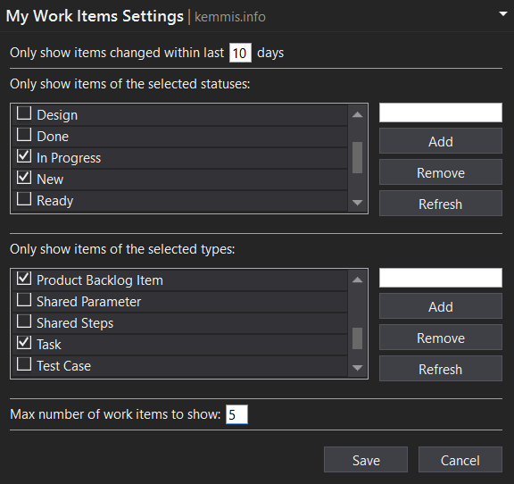

This is an extension for Visual Studio 2015 and 2017 that makes it quick and easy to 
associate your TFS work items when checking in pending changes. You tell the 
extension what type and status of work items you want to see in the Pending 
Changes page, and then they magically show up for you to choose from.

## Download

[Get it for VS 2017](https://marketplace.visualstudio.com/items?itemName=TheRealRafeKemmis.MyWorkItemsforVS2017)

[Get it for VS 2015](https://marketplace.visualstudio.com/items?itemName=TheRealRafeKemmis.MyWorkItemsOnPendingChangesPageforVisualStudio2015)

## Settings

#### Only show items changed within last __ days

This limits the extension search query to only find work items that have been
modified within the last specified number of days. For instance, if you set this
to 5, then only items that have been changed within the last 5 days will show up 
in the list of work items.

One thing to note is that changing the status of a work item does count as having
"changed" the item. So if you have items you want to show up, you can drag them
from 'To do' to 'In progress', and that should make the item show up in the list
since the status change updated the 'last changed' property of the work item.

#### Only show items of the selected statuses

You likely only want to see items that are in a particular status. If you only
want to see items that are in the New and In Progress statuses, then you can 
check those two statuses and uncheck the others.

If for some reason the extension doesn't show a status that you want to see,
you can simply type it into the empty box to the right and then click the Add button.

#### Only show items of the selected types

Additionally, you probably only want to see certain types of work items. Select the
work item types you want to see, and don't select the ones you don't want to see.

If for some reason the extension doesn't show a work item type that you want to see,
you can simply typ it into the empty box to the right and then click the Add button.

#### Max number of work items to show

This limits the work item list to showing the most recent specified number of work items.

# Building & Debugging

http://stackoverflow.com/questions/9281662/how-to-debug-visual-studio-extensions